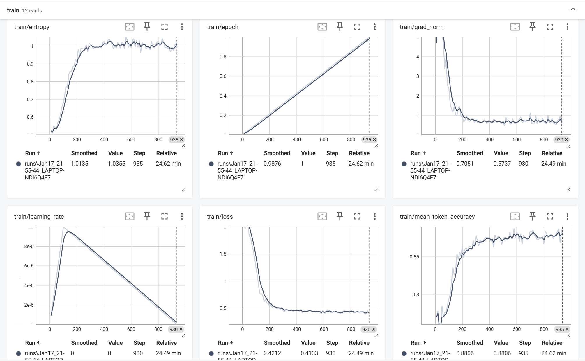

# agentic-rl-practice
本项目实现了agentic-rl训练，从模型的SFT训练再到模型的GRPO训练，两个阶段的数据集都是：openai/gsm8k，项目的部分源码参考自datawhale社区的 [hello-agent项目](https://github.com/jjyaoao/helloagents)，训练的模型是Qwen3-1.7B
## 模型下载
```shell
# 修改全局配置 common/global_config.py
python download_model_ms.py
```
## SFT训练
采用lora高效微调，对模型注意力模块线性层(q_proj、k_proj、v_proj、o_proj)增加旁路可训练低秩矩阵
### 训练
+ 命令
```shell
cd train
CUDA_VISIBLE_DEVICES=0 python train_sft.py
```
+ 训练过程曲线


## GRPO训练
在sft的基础上再训练，将lora模块重新置为*可训练*，其他模块冻结  
奖励函数采用：
+ 准确度：不要求答案和gt一致，可传入容忍值，相差在容忍值内，则奖励1，否则0
+ 推理步数：每个推理步数奖励0.1，最高奖励0.5
```python
base_model = AutoModelForCausalLM.from_pretrained(base_model_path, trust_remote_code=True)
model = PeftModel.from_pretrained(base_model, "output/sft_output")
for name, params in model.named_parameters():
    if "lora" in name:
        params.requires_grad_(True)
```
+ 命令
```shell
cd train
CUDA_VISIBLE_DEVICES=0 python train_grpo.py
```
## 推理
### transformers API
```shell
# -q: 问题
# -m: 推理模式(sft, grpo)，用于控制加载lora模块
# -r: 传入则开启推理模式，不传则不开启推理模式
python inference.py -q "2的10次方除以32等于多少？" -m grpo -r
```
### vllm
+ 启动服务
```shell
vllm serve <base_model_path> \
    --enable-lora \
    --lora-modules sft-lora=./train/output/sft_output grpo-lora=./train/output/grpo_output \
    --enable-reasoning --reasoning-parser deepseek_r1
```
+ 请求
```shell
curl http://localhost:8000/v1/completions \
    -H "Content-Type: application/json" \
    -d '{
        "model": "sft-lora",
        "prompt": "2的10次方除以32等于多少？",
        "max_tokens": 1024
    }'
```

